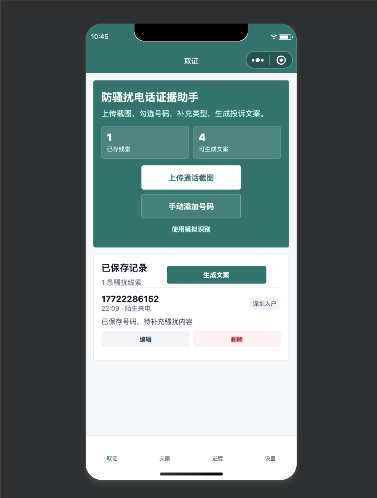

# 防骚扰电话证据助手小程序

这是一个微信小程序 MVP 工程，用于把骚扰电话截图和线索整理成投诉材料。

## 界面预览



## 当前功能

- 上传通话截图并通过 OCR 提取疑似电话号码。
- 从识别结果中勾选需要保留的号码。
- 补充来电时间、来电状态、骚扰类型、公司名、备注和录音情况。
- 生成 12321、运营商、12345、12381 投诉文案。
- 一键复制投诉文案和投诉入口。
- 保存投诉进度。
- 清空本地数据。
- 微信云函数：`ocrRecognize`、`saveRecord`。

## 目录结构

- `miniprogram/`：微信小程序前端。
- `cloudfunctions/`：微信云函数骨架。
- `scripts/`：本地测试脚本。
- `images/`：README 展示截图。

## 如何运行

1. 安装微信开发者工具。
2. 打开微信开发者工具，导入当前目录。
3. 如果还没有正式 AppID，可以先使用测试号或游客模式。
4. 后续拿到正式 AppID 后，替换 `project.config.json` 里的 `appid`。
5. 如果开通云开发，把云环境 ID 填入 `miniprogram/app.js` 的 `globalData.envId`。
6. 部署 `cloudfunctions/ocrRecognize` 后，在云函数环境变量中配置 OCR 密钥。

## 本地测试

在项目根目录运行：

```bash
node scripts/test_templates.js
```

该脚本验证投诉模板和证据评分的基础逻辑。

## OCR 配置

当前 `cloudfunctions/ocrRecognize` 使用腾讯云 OCR。没有配置云环境时，小程序会自动回退到模拟 OCR。正式接入时：

1. 开通微信云开发。
2. 在 `miniprogram/app.js` 中配置云环境 ID。
3. 上传并部署 `ocrRecognize` 云函数。
4. 在云函数环境变量中配置密钥。
5. 上传截图到云存储，拿到 `fileID`。
6. 云函数下载图片并调用 OCR。
7. 将 OCR 文本解析成号码、时间和来电状态。
8. 返回给小程序确认页。

## 密钥安全

- `project.config.json` 里只保存小程序 AppID。
- AppSecret、OCR SecretId、OCR SecretKey 不要写入小程序前端代码。
- 需要服务端调用时，把密钥配置到微信云函数环境变量中。
- 如果 AppSecret 曾经暴露到聊天、截图或公开仓库，建议在微信公众平台重置。

## 上线前需要你准备

- 微信小程序企业认证。
- 正式 AppID。
- 小程序名称、Logo、简介、服务类目。
- 云开发环境 ID。
- OCR 服务密钥。
- 隐私政策和用户协议最终文本。
- 1 到 3 张打码后的真实通话截图用于识别调优。

## 重要边界

本小程序不是官方投诉渠道，不自动代用户提交 12321、12345、12381 或运营商投诉。它只帮助用户整理材料、生成文案和记录进度，最终提交由用户自行完成。
